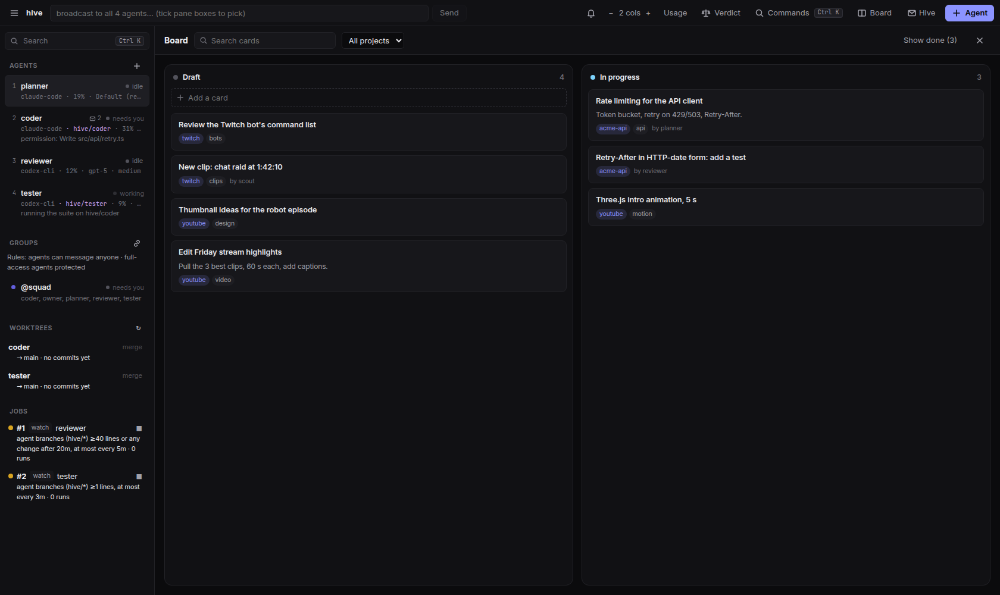
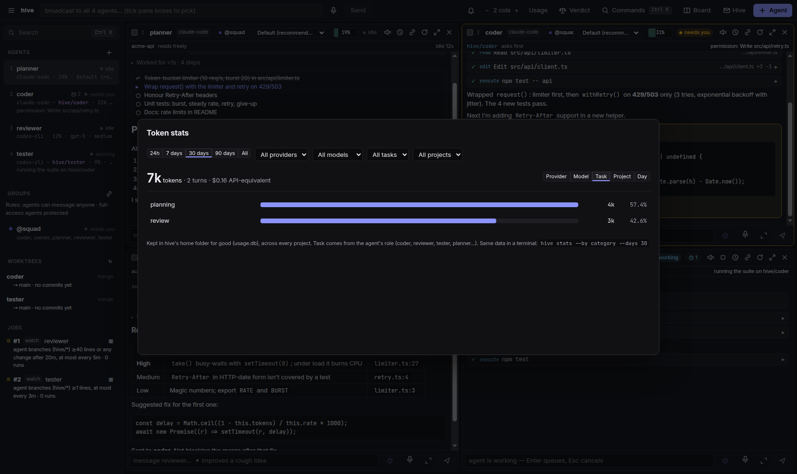
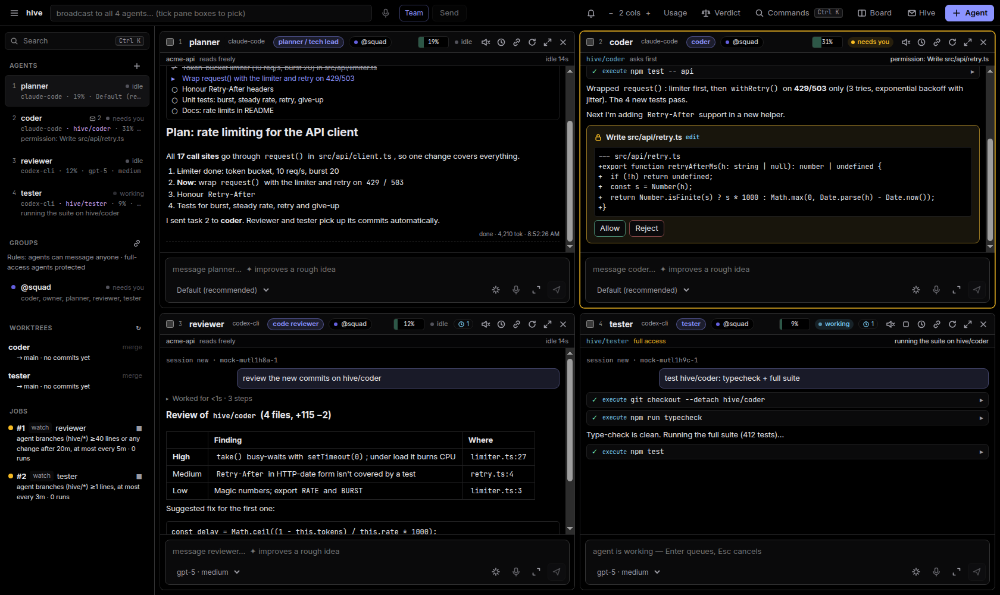
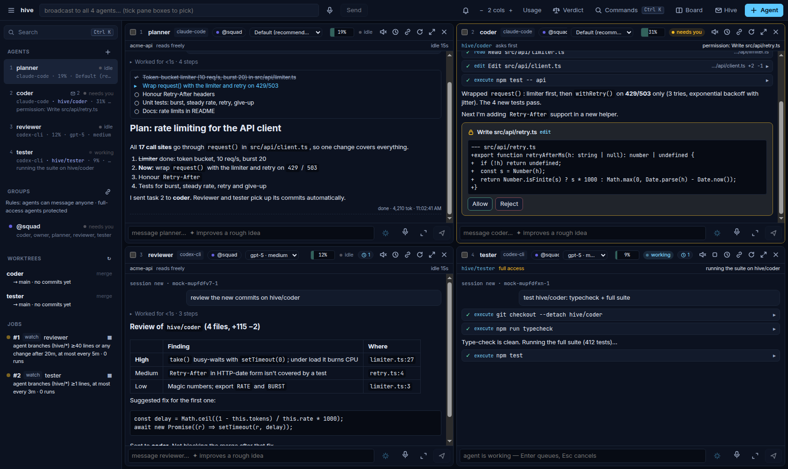
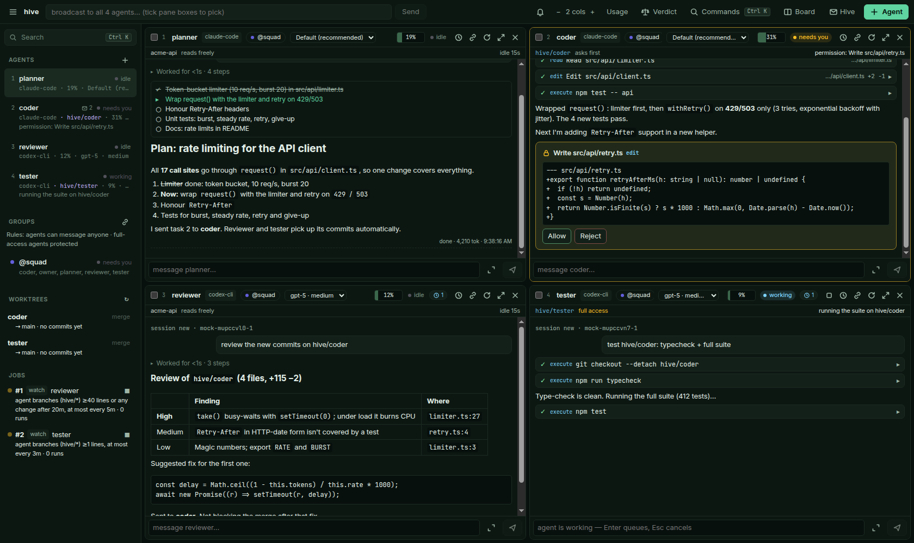
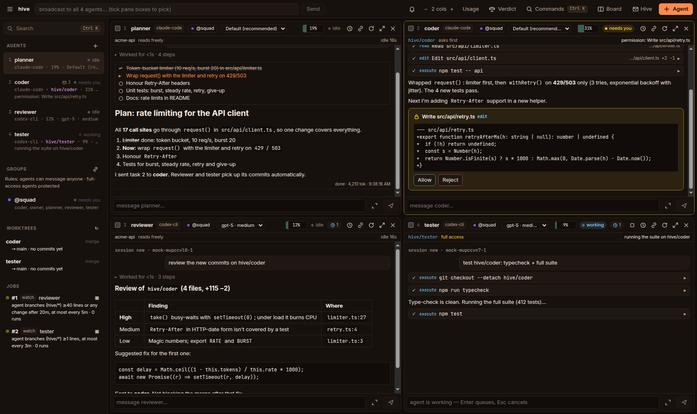
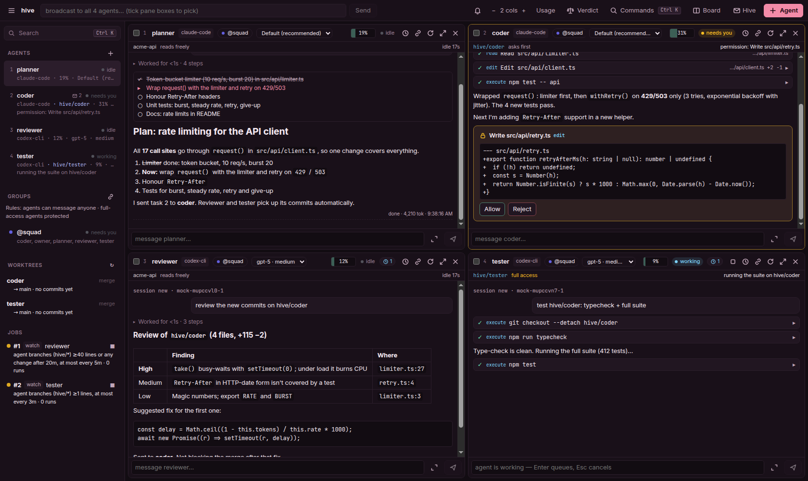
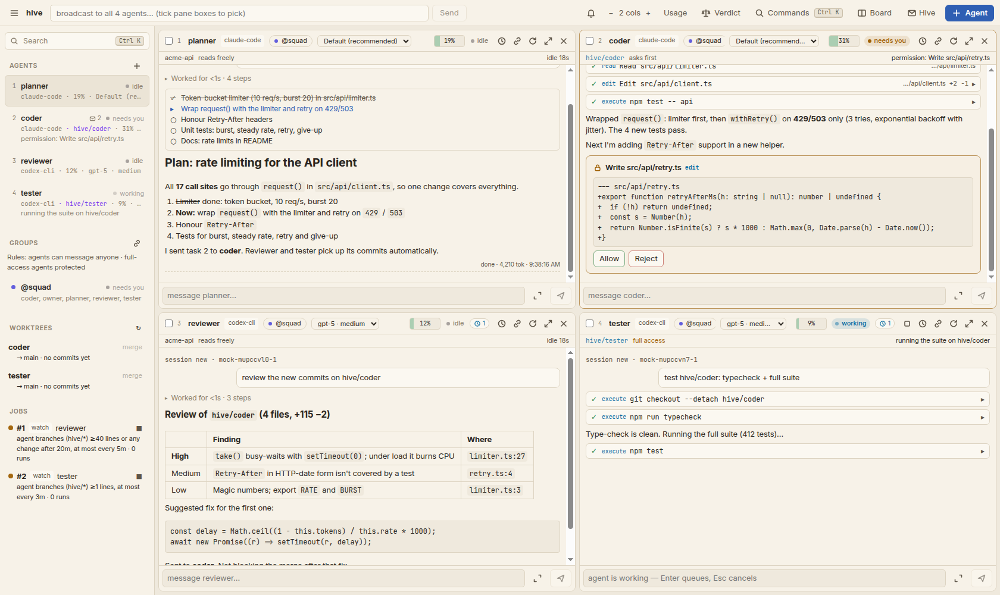

<p align="center">
  
</p>

<h1 align="center">hive</h1>

<p align="center">
  <b>Your coding agents, working as a team and reviewing each other's work.</b><br>
  Runs on your own machine · uses the subscriptions you already have · open source (MIT)
</p>

<p align="center">
  <a href="LICENSE"></a>
  
  
</p>


## Why hive

One AI agent working alone can't see its own mistakes. The fix is the same one software teams use: **someone else reviews the work before it lands.**

hive gives your agents that team:

- **Autonomous review.** A coder's change goes to a reviewer agent automatically, ideally from another vendor (Codex checks Claude's work, or the other way round). A security watcher reads every 50 changed lines. A tester runs the suite. They send findings back, and the coder fixes them. You step in for decisions, not for every hand-off.
- **Group work.** Agents have roles (planner, coder, reviewer, tester, scout) and talk through mail, groups and a shared blackboard. Broadcast one task and hive names a **lead**. The lead plans and hands each teammate the part that fits their role, while the rest wait instead of duplicating work ([docs/TEAMWORK.md](docs/TEAMWORK.md)).
- **It keeps going while you're away.** Loops, schedules and file watchers run all night. A scout finds improvements and passes them to the coder, and the coder **asks you before building them**. When you come back, "Since you left" shows what happened.
- **Your agents, your machine.** Every agent is the vendor's own program (Claude Code, Codex, Gemini CLI, Qwen, OpenCode) driven over the [Agent Client Protocol](https://agentclientprotocol.com). Your subscriptions, logins and sandboxes keep working, and nothing listens on the network.

## How it compares

| | **hive** | Orchestration frameworks<br><sub>(LangGraph, CrewAI, AutoGen…)</sub> | Agent harnesses / terminal managers<br><sub>(several CLIs side by side)</sub> | **Grok Bot** (xAI)<br><sub>beta, Aug 2026</sub> | **OpenAI Dots**<br><sub>DevDay, Sep 2026</sub> |
|---|---|---|---|---|---|
| What it is | a desktop app that runs your coding agents as a team | libraries you program agents with | panes or tabs for several coding CLIs | a team of always-on cloud agents | named, always-on agents inside ChatGPT |
| Runs on | **your machine** (or your server) | wherever you deploy your code | your machine | xAI's cloud: each bot has its own cloud computer | OpenAI's cloud: each dot has its own cloud computer |
| Agents | the vendors' own coding agents, **mixed vendors** in one team, plus any API model | the model APIs you wire in | the vendors' own CLIs | Grok | GPT models |
| Agents review each other | **yes, built in**: review groups, security watcher, blind judge (Verdict) | if you build it | usually no; each session works alone | bots coordinate in group chats | not described |
| Team coordination | lead + roles, mail, groups, blackboard, held messages | your code decides | little or none | one bot coordinates the others in a group chat | each dot works on its own goals |
| Works while you're away | jobs, loops, watchers, budgets, pause switch | if you deploy it | no | yes | yes |
| Pay with | **subscriptions you already have** (or API keys) | API keys | your subscriptions | a Grok / Cursor plan | a ChatGPT Pro or Business plan |
| Open source | **yes, MIT** | mostly yes | varies | no | no |

**Similar to Grok Bot and Dots:** named agents that keep working, coordinate, and ask you when a decision is yours.
**Similar to harnesses:** you watch real vendor CLIs side by side and step in any time.
**Similar to orchestrators:** roles, hand-offs and pipelines.

**Different:** it runs locally on your code and accounts, it mixes vendors so they catch each other's mistakes, review is the default rather than an add-on, and it's free and open. More detail, including comparisons with Maestro, Agent Deck, Zed and Claude Code teams: [docs/COMPARISON.md](docs/COMPARISON.md).

## Install

You need **Node.js 22+** and **Git**. The Windows script installs both if they're missing. `<repo-url>` is this page's address: the green **Code** button → copy.

**Windows** (PowerShell):

```powershell
git clone <repo-url> hive
cd hive
powershell -ExecutionPolicy Bypass -File scripts\install-windows.ps1
```

This builds hive, puts `hive` on your PATH and adds a **hive** icon to your Desktop and Start menu. Step by step: [docs/WINDOWS.md](docs/WINDOWS.md).

**Linux** (Fedora, Ubuntu; macOS should work but isn't tested):

```bash
git clone <repo-url> hive && cd hive
npm install && npm run build && npm link
```

Then:

1. Sign in to the agents you use, once: `claude` (then `/login`), `codex login`, `gemini`. Check with `hive doctor`.
2. Open hive: double-click the icon, or type `hive` in your project folder.
3. Press **Ctrl+K** → "Set up a team" → **Squad** (planner, coder, reviewer, tester).

No subscription yet? `npm test` runs everything with a built-in mock agent, with no logins and no network. Server, phone and remote setups are in [docs/START-HERE.md](docs/START-HERE.md).

## What's in it

| | |
|---|---|
| Agents | Claude Code, Codex, Gemini CLI, Qwen, OpenCode through ACP (your subscriptions), plus API models: Gemini, OpenRouter (Meta Llama…), OpenAI, Meta Llama API, Ollama, any OpenAI-compatible endpoint ([docs/MODELS.md](docs/MODELS.md)) |
| Working together | mail, groups, shared blackboard, follow-ups; drag panes together to link agents, with a review-each-message layer and safe defaults for full-access agents |
| Verdict mode | one prompt to several agents in their own worktrees, a blind judge picks the best parts, one click builds the merge ([docs/VERDICT.md](docs/VERDICT.md)) |
| Automation | loops, intervals, watch-for-new-code/commits/blackboard, cooldowns, recipes (coder + reviewer, tester + improver, idea pipeline, creator studio) |
| Skills | prompts with parameters (YouTube titles/descriptions/chapters from a transcript **or a YouTube link**, code review, prompt-engineer) |
| Memory & learning | hive remembers you and each project (plain markdown every agent reads), suggests memory lines and new skills from your chats and from what you keep asking for; nothing is saved without your OK ([docs/MEMORY.md](docs/MEMORY.md)) |
| Media | ElevenLabs voice-over, image generate/edit (keys stay in the hive process) |
| Devices | a sandboxed browser (its own Chromium profile, never your logins) and an Android emulator/phone pane over adb; you watch and click, agents test web and Android apps with `hive_browser_*` / `hive_android_*` ([docs/DEVICES.md](docs/DEVICES.md)) |
| Voice | dictation on every prompt box (mic button or hold Ctrl+Shift+Space; local Whisper, OpenAI or ElevenLabs), each agent can answer out loud in its own voice, "Talk with &lt;agent&gt;" conversation mode ([docs/VOICE.md](docs/VOICE.md)) |
| Motion graphics | HTML/three.js animations rendered frame by frame to MP4 or ProRes 4444 with alpha for DaVinci (`hive render`, skill `motion`, starter template) ([docs/CREATOR.md](docs/CREATOR.md)) |
| Twitch | new VODs and clips become board cards (`hive twitch watch`); recipe `twitch-clips`: a clipper cuts shorts with yt-dlp + ffmpeg, a studio agent writes titles ([docs/CREATOR.md](docs/CREATOR.md)) |
| Board & stats | Kanban board for notes and projects (agents and automations add cards; `hive board`), token ledger by provider / model / task / project (`hive stats`) |
| Safety & cost | per-agent permission policies, worktrees, untrusted-content labelling, usage + limit windows with reset times, daily budgets, pause switch |
| Terminal | `hive tui`: the pane grid in your terminal, starting with a four-agent squad (planner, coder, reviewer, tester); `/add`, `/rm`, `/link`, `/group` ([docs/TUI.md](docs/TUI.md)) |
| Cloud | run hive on a server or VPS and open the same agents, sessions, board and stats from any machine: `hive ui --remote you@server --remote-cwd ~/code/app` ([docs/CLOUD.md](docs/CLOUD.md)) |
| Phone | Tailscale + SSH + tmux: `hive tui` from anywhere, one-command setup for Ubuntu/Fedora/Windows; Discord pushes ([docs/REMOTE.md](docs/REMOTE.md)) |
| Phone app | the full pane UI on your phone: `hive web` + `tailscale serve`, one agent per screen with a bottom bar; install it from Chrome (PWA) or as an Android APK ([docs/MOBILE.md](docs/MOBILE.md)) |
| Platforms | Windows ([docs/WINDOWS.md](docs/WINDOWS.md), one-script install), Linux/Fedora ([docs/LINUX.md](docs/LINUX.md)), Ubuntu server + chat bridges ([docs/BRIDGES.md](docs/BRIDGES.md)) |
| Extra MCP servers | attach DaVinci Resolve or any MCP server to an agent type (`agents.json`) or one agent (`--mcp NAME`, Add-agent checkboxes) ([docs/MCP.md](docs/MCP.md)) |

Architecture and source map: [docs/ARCHITECTURE.md](docs/ARCHITECTURE.md). Audit records: [audit/](audit/). Contributing: [CONTRIBUTING.md](CONTRIBUTING.md).

## Screenshots

<sub>Demo session with scripted agents on a sample repo (no model output); regenerate with `xvfb-run -a npx tsx test/showcase.ts`.</sub>

| | |
|---|---|
|  **Ctrl+K palette:** every agent with its state, every action with its shortcut |  **Focus an agent (Ctrl+M):** file reads, diffs, test runs, a permission prompt answered inline |
|  **Reviewer:** finished turns fold their tool calls into "Worked for …" so the answer is what you read |  **Group chat:** what linked agents said to each other; review-each-message mode holds mail for you |
|  **Since you left:** what needs you, job runs, blackboard changes |  **Usage:** limit windows, daily caps, pause all automatic work |
|  **Verdict:** one prompt to several agents, a blind judge picks the best parts |  **Recipes:** ready-made teams (squad, coder + reviewer, idea pipeline, creator studio) |
|  **Board (Ctrl+J):** Draft, In progress, Done hidden away; agents add cards too |  **Token stats:** by provider, model, task and project, across all projects |
|  **Themes and density** from the palette |  **`hive tui`:** the same squad in a terminal, over SSH from your phone |

**Themes:** Dark, OLED black, Midnight, Forest, Ember, Rosé, Light, Paper (Ctrl+K → "theme").

<table><tr>
<td><br><sub>OLED black</sub></td>
<td><br><sub>Midnight</sub></td>
<td><br><sub>Forest</sub></td>
</tr><tr>
<td><br><sub>Ember</sub></td>
<td><br><sub>Rosé</sub></td>
<td><br><sub>Paper</sub></td>
</tr></table>


**Vertical monitors:** on a 9:16 screen (or a narrow window) panes stack in one column and the sidebar hides; `Auto` switches by aspect ratio.

<br clear="right">

## Everyday use

```
cd ~/code/myproject
hive                             # open the app on this project
hive doctor                      # installed? speaks ACP? logged in?
hive chat claude --as coder      # or chat in the terminal
hive tui                         # the pane grid in a terminal (works over SSH)
```

All state lives outside your repo, in one hive per project: `%LOCALAPPDATA%\hive\projects\<repo>-<hash>\` on Windows (`~/.local/state/hive/…` on Linux, `~/Library/Application Support/hive/…` on macOS; override with `HIVE_HOME`). That's the SQLite db, `ui.json`, watch snapshots and agent worktrees. Run `hive` from anywhere inside the repo (or pass `--cwd`) and you get the same hive.

## CLI

```
hive run <agent> "prompt"                  one prompt, wait for replies to settle, exit
hive chat <agent>                          interactive; reopening a name resumes its session, folder and preset (--fresh for new)
hive agents                                who's in the hive, status, unread mail
hive doctor [agent...] [--quick]           probes each adapter with ACP initialize + auth push
hive ui                                    the pane UI for this project

hive loop  <agent> --times 5 "prompt"      back-to-back runs, fresh session each, shared notes file
hive loop  <agent> --for 8h  "prompt"      … until the time is up
hive every <agent> 10m "prompt"            on an interval
hive watch <agent> <path> --min-lines 50 "prompt"   when enough lines change (untracked files count)
hive watch <agent> --branches "prompt"     when enough lines are committed on agents' hive/* branches
hive once  <agent> --in 20m "prompt"
hive start <agent> --as security|scout|bughunter    a role preset's default job (agent named after the preset)
hive jobs [--all] · hive job stop|start|runs|show|rm <id|agent>
hive serve                                 run queued jobs, deliver mail (waking sleeping agents)

hive report [--since 12h]                  job runs + summaries, commits on agent branches, mail to you
hive inbox · hive send <agent|*> "text"    mail between you ("owner") and agents
hive bb [prefix] · hive bb rm <key>        the shared blackboard
hive log <agent>                           what an agent was asked and answered

hive worktrees                             agent branches: ahead/behind, diffstat, uncommitted
hive merge <name>                          merge hive/<name> into the main checkout (--no-ff), then fast-forward the agent
hive sync <name>                           merge the main branch into the agent's worktree
hive worktree rm <name> [--force]
```

Common options: `--name N --cwd DIR --role R --policy ask|allow-reads|allow-all|reject-all --as <preset> --worktree --db PATH --quiet`.

Job commands run in the foreground until the job ends (Ctrl-C stops it). `--detach` only queues the job; `hive serve` (or the UI) runs it.

In `chat`: type while the agent works (prompts queue), Ctrl-C cancels a turn, Ctrl-C when idle quits, `/new` fresh session, `/model <id>`, `/config`, `/status`.

## Pane UI

`hive ui` (or `npm run ui`) builds and starts the Electron app for the current project (`--cwd` to pick another).

- **Ctrl+K** opens the command palette: every agent with its state (needs you / error / working / done / idle; type a state word to filter) and every action with its shortcut: new agent, team, verdict, skills (Ctrl+Shift+K), link, inbox, usage, layout, theme (dark/light), density. Ctrl+B sidebar, Ctrl+Shift+B broadcast, Ctrl+Shift+[ / ] previous / next pane.
- Grid of panes, N per row, drag the gaps to resize, Ctrl+M maximizes, Ctrl+= / Ctrl+- zoom. Layout persists per project; panes come back (and their ACP sessions resume) on restart.
- Sidebar: every agent with model/effort, idle time, ctx %, unread mail, status note; other agents in the hive (e.g. run by `hive serve`); worktrees with a merge button; jobs (click for run history and summaries).
- ✉ Hive drawer (Ctrl+I): since-you-left report, mail agents sent you, the blackboard, all mail, and a box to message agents.
- **✦ Improve** (button, Ctrl+Shift+Enter, or start with `/improve`): type a rough idea in any agent's box and it becomes a full prompt for that agent, written by a short-lived helper of the same agent type that sees the recent chat; edit it and press Enter to send it in the same chat (Ctrl+Z / undo restores your draft). Your agent's conversation never sees the request. Also `/improve …` in `hive tui`.
- Each pane: a state pill in the header (only the focused pane gets an accent edge), finished turns fold their tool calls into one "Worked for 1m 12s" line, markdown replies, collapsible thinking, tool cards with diffs, plan checklist, permission prompts and agent questions answered inline, model/effort selectors, ctx meter, ⏱ to schedule a loop / interval / watch job on that agent.
- Input routing for voice typing (Handy): hover a pane to focus its input (short dwell; never leaves an unsent draft; toggle with Ctrl+K → "hover"), Ctrl+1..9 jump, Ctrl+Tab cycle, Ctrl+Alt+H (global) brings hive forward on the last active pane. Enter sends (queues while busy), Esc cancels, ↑ recalls.
- Broadcast box: send one prompt to the ticked panes, or all.

Architecture: Electron main is a relay; the hub runs in a system-Node child process (`src/ui/backend.ts`) that speaks NDJSON over stdio, so native modules need no Electron rebuild and no socket is ever opened. Renderer is sandboxed with a strict CSP.

## Role presets

`--as <preset>` on the CLI or the Preset field in the UI:

| preset | policy | worktree | default job |
|---|---|---|---|
| coder | ask | yes | — |
| reviewer | allow-reads | no | — |
| security | allow-reads | no | watch ≥50 changed lines |
| scout | allow-reads | no | every 10m |
| teacher | allow-reads | no | — (explains code to you; see [Learn while you build](#learn-while-you-build)) |
| bughunter | allow-all | yes | loop 5× |

## Learn while you build

Read the code your agents write, and have an agent explain it. Details for beginners: [docs/LEARN.md](docs/LEARN.md).

- **Code view** (Ctrl+P, or Ctrl+K → "Open file…" / "Browse code", or click a file path in a tool card or diff): file tree of the focused agent's folder (its worktree if it has one; switch folders at the top), syntax highlighting, M/N marks for modified and new files, and a **Changes** tab with the agent's branch against its base. Read-only.
- **Ask about code:** select lines (drag, or click / Shift+click line numbers) → Explain, Why like this?, Simpler?, Quiz me or Ask…. The question goes to your **teacher** with the file, line range and code; its answer appears next to the code.
- **Teacher** (Ctrl+K → "Start a teacher", or the `teacher` preset): reads code, never changes it; short paragraphs tied to exact lines, jargon defined, one quiz question when asked; new terms go on your board as cards labelled `glossary`.
- **Explain every change** (toggle per agent in the code view or Ctrl+K): after each turn of that agent that changes files, the teacher explains the diff (trimmed to 8 KB, at most once per agent every 2 minutes). It's automatic work, so it costs tokens and your spending guards apply.

## Scheduler

Jobs live in the SQLite `jobs` table; runs in `job_runs` (stop reason, usage, session id, error).

- **Fresh session per run** plus `<cwd>/.hive/notes/job-<id>.md`, which the prompt tells the agent to read first and update before finishing (the Ralph-loop pattern: iterations hand over through the notes file, not one ever-growing context).
- **watch** snapshots the tree into a shadow git index in the project's state dir and counts `git diff --numstat` lines between snapshots, so new untracked files count and your own index is never touched. `.git`, `node_modules`, `.hive` are ignored; `.gitignore` is honoured. The prompt lists what changed.
- **watch --branches** follows the agents' `hive/*` branches instead, so a security reviewer sees coders' commits in their worktrees; the prompt lists each branch range for `hive_diff`.
- Jobs are claimed with a lease, so `hive serve`, the UI and a foreground `hive loop` never run the same job twice. Stopping a job cancels its in-flight turn. Five failures in a row end a job as `failed`. A usage limit (e.g. the 5-hour window) pauses the job until the reset instead.
- Unattended job agents may always edit their own notes file and call hive's tools; any other prompt nobody answers is declined after 15 minutes.

## Worktrees

`--worktree` (or the coder/bughunter presets) runs an agent in its own git worktree (in the project's state dir, outside your checkout) on branch `hive/<name>`. Reviewers read it with the `hive_diff` / `hive_log` tools, no shell needed. `hive merge <name>` does a `--no-ff` merge into the main checkout, refusing if it has uncommitted changes and aborting cleanly on conflict.

## How a message flows

```
alice (claude)  ── hive_send(to: bob) ──▶  sqlite messages
                                              │
hub delivery loop (1.5 s): bob idle && unread>0
                                              ▼
bob (codex)  ◀── prompt: "You have 1 unread hive message: 1 from alice ("review auth")…"
bob ── hive_inbox ── hive_send(to: alice, thread) ──▶ sqlite
hub wakes alice the same way.
```

Agents never block waiting for replies inside a turn; the briefing tells them so. Identity is set by the hub through env (`HIVE_AGENT`), not by the agent, so an agent can't impersonate another.

## Permission policy

Per agent: `ask` (UI pane or terminal), `allow-reads` (auto-approve read/search/fetch, ask for the rest), `allow-all`, `reject-all`. The vendor's own sandbox still applies underneath.

## Vendors

| id | adapter | auth |
|---|---|---|
| claude | `@agentclientprotocol/claude-agent-acp` | `claude login` (Max) or `ANTHROPIC_API_KEY` |
| codex | `@agentclientprotocol/codex-acp` | `codex login` (ChatGPT) or `OPENAI_API_KEY` |
| qwen | `qwen --acp` | `QWEN_BASE_URL` → your Ollama/vLLM, `QWEN_MODEL` |
| opencode | `opencode acp` | any provider (DeepSeek, GLM, OpenRouter, local) via opencode.json |
| gemini | `gemini --experimental-acp` | google login |
| mock | built-in | none |

`hive doctor` spawns each adapter, sends `initialize`, and waits for its `_auth/status_update` push, so it reports "not logged in" vs the account actually in use.

## Code layout

The source map, design rules and how to run things from source are in [docs/ARCHITECTURE.md](docs/ARCHITECTURE.md).

## License

MIT, see [LICENSE](LICENSE). Security reports: [SECURITY.md](SECURITY.md).
