# hive

Local multi-agent harness. One process, any number of coding agents (Claude Code, Codex, Qwen, OpenCode, Gemini, …), all driven through the [Agent Client Protocol](https://agentclientprotocol.com), all able to message each other, with loops, schedules and file watchers that run 24/7.

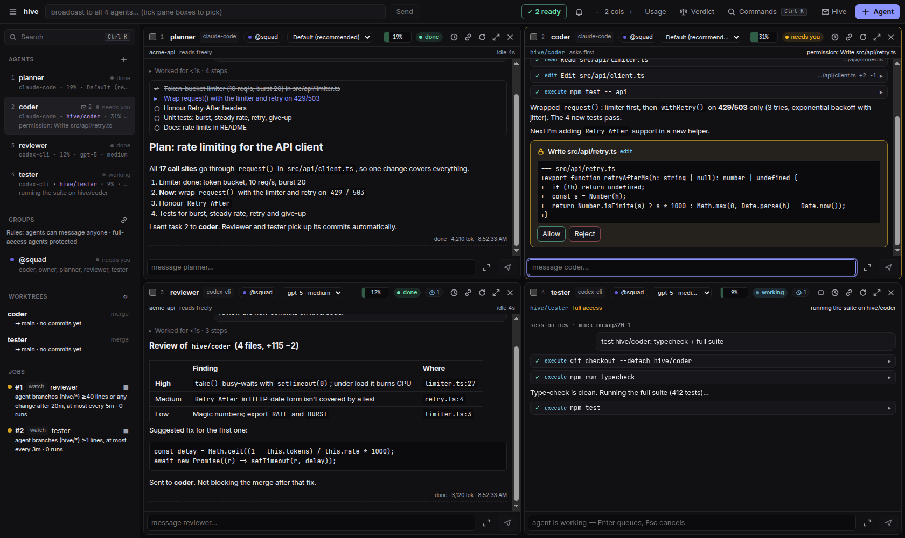

Design goals, in order:

1. **Your subscriptions keep working.** Every agent is the vendor's own binary behind its official ACP adapter. Auth, sandboxing and permission prompts are the vendor's; hive never re-implements the agent loop.
2. **Agents talk to each other** through a `hive` MCP server injected into every session. Same tools for every vendor, no per-CLI hacks.
3. **Runs 24/7 on one machine.** Nothing listens on the network. Optional Discord/WhatsApp bridges connect *out*, allowlisted.
4. **Many agents on one screen.** A pane grid for a 4K monitor (or a vertical 9:16 one), voice-friendly input routing.

## What's in it

| | |
|---|---|
| Agents | Claude Code, Codex, Gemini CLI, Qwen, OpenCode through ACP (your subscriptions), plus API models: Gemini, OpenRouter (Meta Llama…), OpenAI, Meta Llama API, Ollama, any OpenAI-compatible endpoint ([docs/MODELS.md](docs/MODELS.md)) |
| Working together | mail, groups, shared blackboard, follow-ups; drag panes together to link agents, with a review-each-message layer and safe defaults for full-access agents |
| Verdict mode | one prompt to several agents in their own worktrees, a blind judge picks the best parts, one click builds the merge ([docs/VERDICT.md](docs/VERDICT.md)) |
| Automation | loops, intervals, watch-for-new-code/commits/blackboard, cooldowns, recipes (coder + reviewer, tester + improver, idea pipeline, creator studio) |
| Skills | prompts with parameters (YouTube titles/descriptions/chapters from a transcript **or a YouTube link**, code review, prompt-engineer) |
| Media | ElevenLabs voice-over, image generate/edit (keys stay in the hive process) |
| Safety & cost | per-agent permission policies, worktrees, untrusted-content labelling, usage + limit windows with reset times, daily budgets, pause switch |
| Terminal | `hive tui`: the pane grid in your terminal, starting with a four-agent squad (planner, coder, reviewer, tester); `/add`, `/rm`, `/link`, `/group` ([docs/TUI.md](docs/TUI.md)) |
| Platforms | Windows ([docs/WINDOWS.md](docs/WINDOWS.md), one-script install), Linux/Fedora ([docs/LINUX.md](docs/LINUX.md)), Ubuntu server + chat bridges ([docs/BRIDGES.md](docs/BRIDGES.md)) |

How it compares with Maestro, Agent Deck, Zed, Claude Code teams and others: [docs/COMPARISON.md](docs/COMPARISON.md). Audit records: [audit/](audit/).

## Screenshots

<sub>Demo session with scripted agents on a sample repo (no model output); regenerate with `xvfb-run -a npx tsx test/showcase.ts`.</sub>

| | |
|---|---|
| 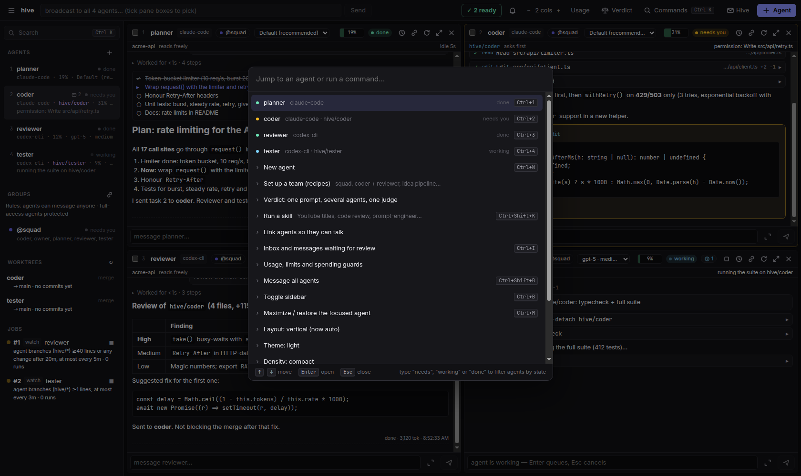 **Ctrl+K palette:** every agent with its state, every action with its shortcut | 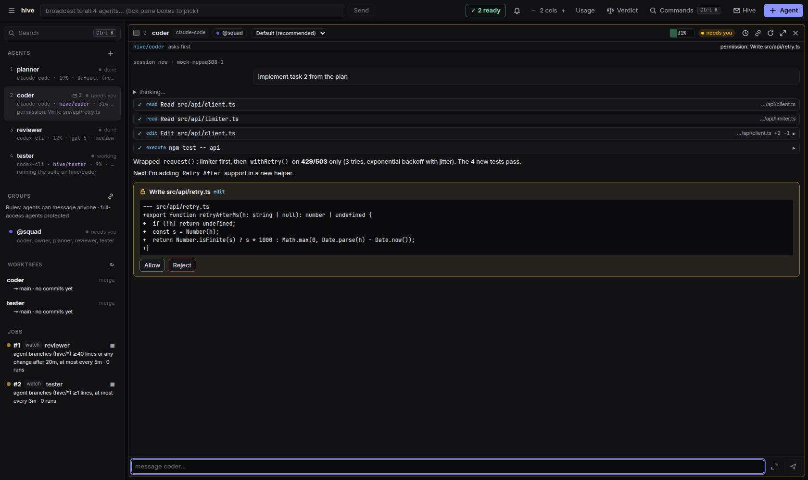 **Focus an agent (Ctrl+M):** file reads, diffs, test runs, a permission prompt answered inline |
| 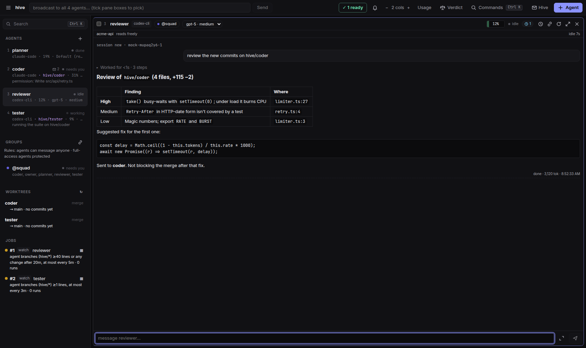 **Reviewer:** finished turns fold their tool calls into "Worked for …" so the answer is what you read | 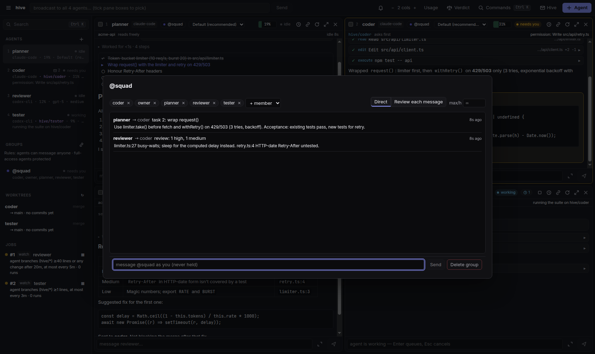 **Group chat:** what linked agents said to each other; review-each-message mode holds mail for you |
| 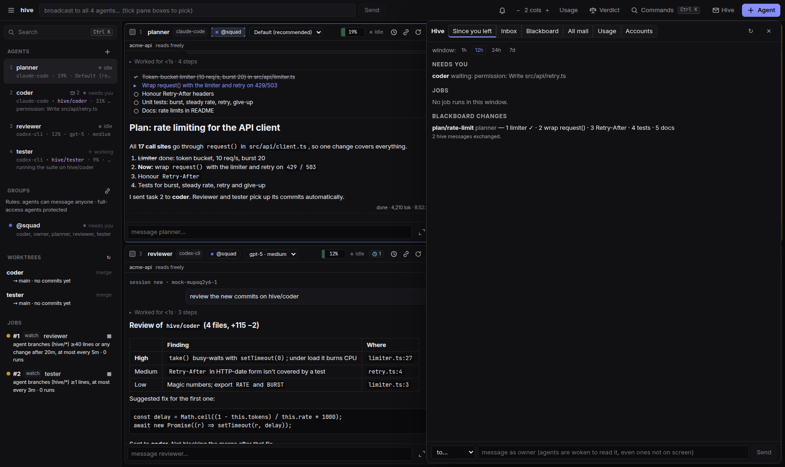 **Since you left:** what needs you, job runs, blackboard changes | 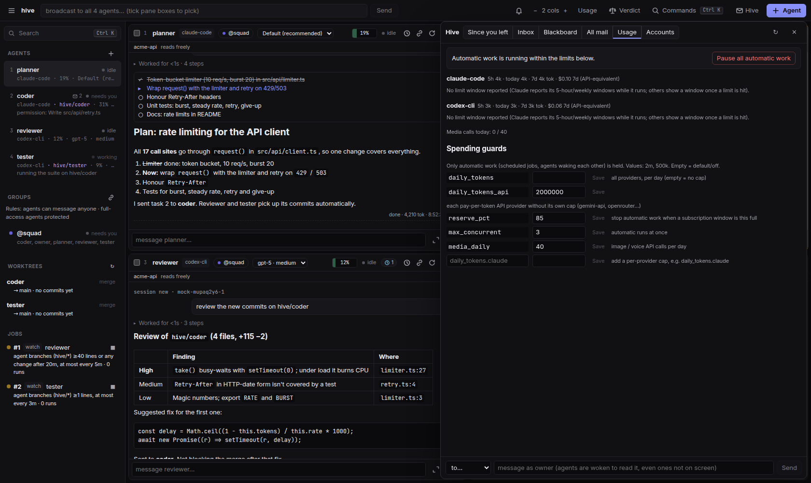 **Usage:** limit windows, daily caps, pause all automatic work |
| 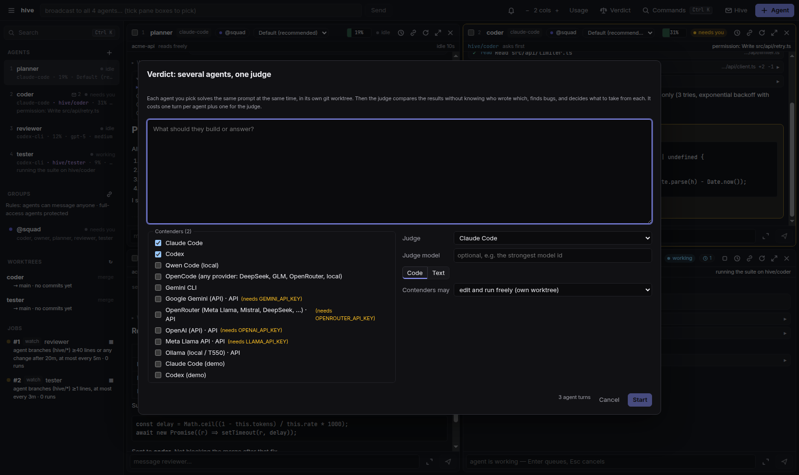 **Verdict:** one prompt to several agents, a blind judge picks the best parts | 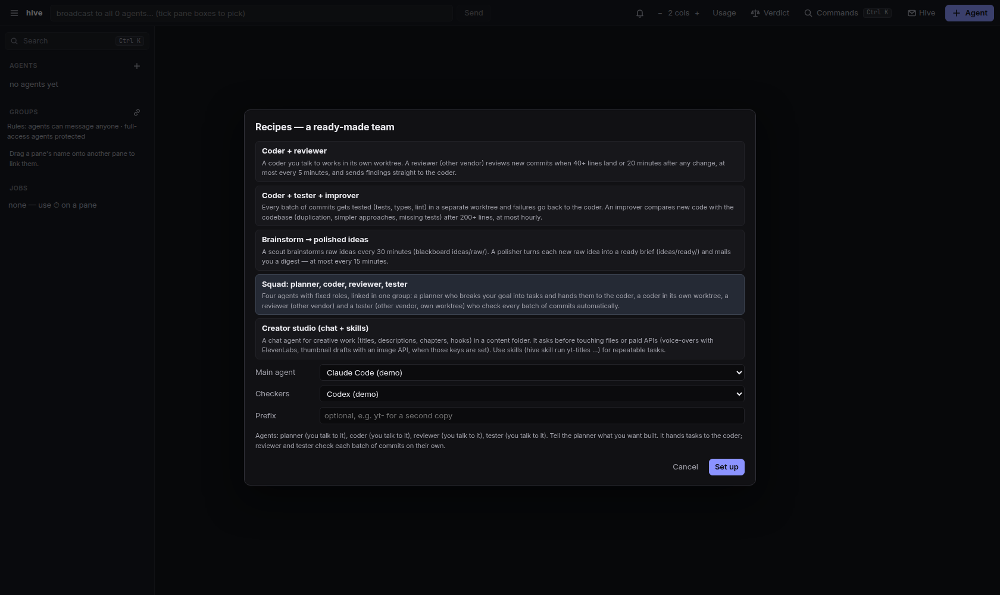 **Recipes:** ready-made teams (squad, coder + reviewer, idea pipeline, creator studio) |
| 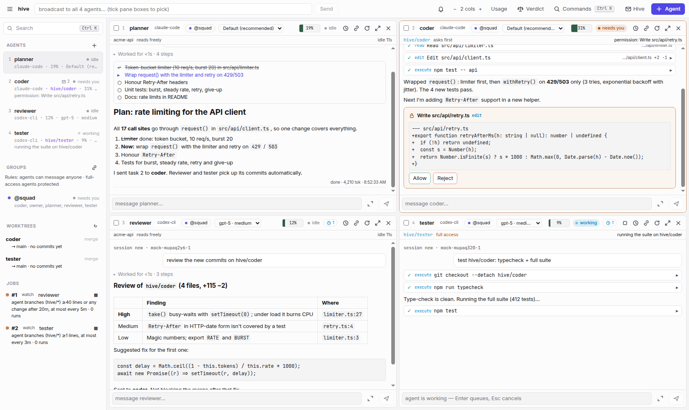 **Light theme and density** from the palette | 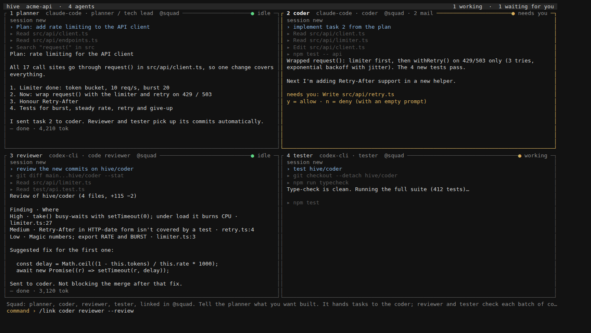 **`hive tui`:** the same squad in a terminal, over SSH from your phone |

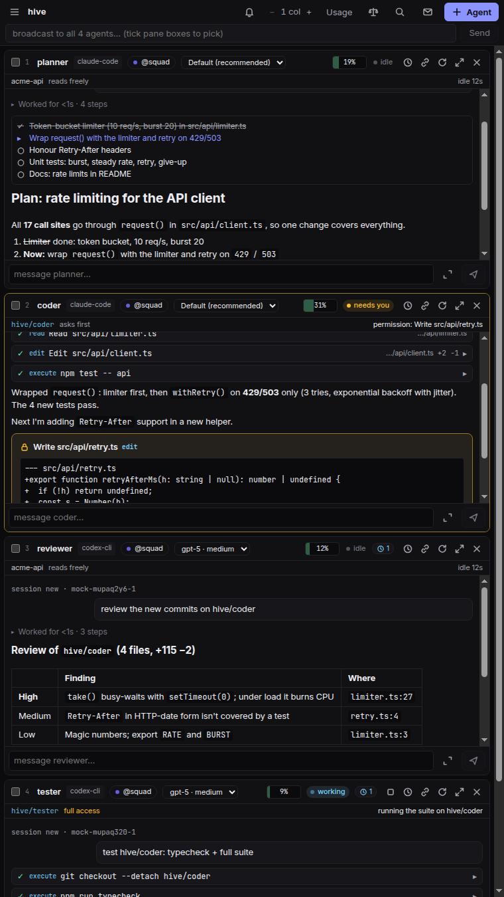

**Vertical monitors:** on a 9:16 screen (or a narrow window) panes stack in one column and the sidebar hides; `Auto` switches by aspect ratio.

<br clear="right">

## Quick start

**On Windows, follow [docs/WINDOWS.md](docs/WINDOWS.md)** (PowerShell, step by step).

```
npm install
npm test                         # mock-agent end-to-end suites (no vendor login needed)
npm run build && npm link        # puts `hive` on your PATH (or use `npm run dev --` from this checkout)
cd ~/code/myproject
hive doctor                      # installed? speaks ACP? logged in?
hive ui                          # the pane UI for this project
hive chat claude --as coder      # or a terminal chat
```

All state lives outside your repo, in one hive per project: `%LOCALAPPDATA%\hive\projects\<repo>-<hash>\` on Windows (`~/.local/state/hive/…` on Linux, `~/Library/Application Support/hive/…` on macOS; override with `HIVE_HOME`). That's the SQLite db, `ui.json`, watch snapshots and agent worktrees. Run `hive` from anywhere inside the repo (or pass `--cwd`) and you get the same hive.

## CLI

```
hive run <agent> "prompt"                  one prompt, wait for replies to settle, exit
hive chat <agent>                          interactive; reopening a name resumes its session, folder and preset (--fresh for new)
hive agents                                who's in the hive, status, unread mail
hive doctor [agent...] [--quick]           probes each adapter with ACP initialize + auth push
hive ui                                    the pane UI for this project

hive loop  <agent> --times 5 "prompt"      back-to-back runs, fresh session each, shared notes file
hive loop  <agent> --for 8h  "prompt"      … until the time is up
hive every <agent> 10m "prompt"            on an interval
hive watch <agent> <path> --min-lines 50 "prompt"   when enough lines change (untracked files count)
hive watch <agent> --branches "prompt"     when enough lines are committed on agents' hive/* branches
hive once  <agent> --in 20m "prompt"
hive start <agent> --as security|scout|bughunter    a role preset's default job (agent named after the preset)
hive jobs [--all] · hive job stop|start|runs|show|rm <id|agent>
hive serve                                 run queued jobs, deliver mail (waking sleeping agents)

hive report [--since 12h]                  job runs + summaries, commits on agent branches, mail to you
hive inbox · hive send <agent|*> "text"    mail between you ("owner") and agents
hive bb [prefix] · hive bb rm <key>        the shared blackboard
hive log <agent>                           what an agent was asked and answered

hive worktrees                             agent branches: ahead/behind, diffstat, uncommitted
hive merge <name>                          merge hive/<name> into the main checkout (--no-ff), then fast-forward the agent
hive sync <name>                           merge the main branch into the agent's worktree
hive worktree rm <name> [--force]
```

Common options: `--name N --cwd DIR --role R --policy ask|allow-reads|allow-all|reject-all --as <preset> --worktree --db PATH --quiet`.

Job commands run in the foreground until the job ends (Ctrl-C stops it). `--detach` only queues the job; `hive serve` (or the UI) runs it.

In `chat`: type while the agent works (prompts queue), Ctrl-C cancels a turn, Ctrl-C when idle quits, `/new` fresh session, `/model <id>`, `/config`, `/status`.

## Pane UI

`hive ui` (or `npm run ui`) builds and starts the Electron app for the current project (`--cwd` to pick another).

- **Ctrl+K** opens the command palette: every agent with its state (needs you / error / working / done / idle; type a state word to filter) and every action with its shortcut: new agent, team, verdict, skills (Ctrl+Shift+K), link, inbox, usage, layout, theme (dark/light), density. Ctrl+B sidebar, Ctrl+Shift+B broadcast, Ctrl+Shift+[ / ] previous / next pane.
- Grid of panes, N per row, drag the gaps to resize, Ctrl+M maximizes, Ctrl+= / Ctrl+- zoom. Layout persists per project; panes come back (and their ACP sessions resume) on restart.
- Sidebar: every agent with model/effort, idle time, ctx %, unread mail, status note; other agents in the hive (e.g. run by `hive serve`); worktrees with a merge button; jobs (click for run history and summaries).
- ✉ Hive drawer (Ctrl+I): since-you-left report, mail agents sent you, the blackboard, all mail, and a box to message agents.
- Each pane: a state pill in the header (only the focused pane gets an accent edge), finished turns fold their tool calls into one "Worked for 1m 12s" line, markdown replies, collapsible thinking, tool cards with diffs, plan checklist, permission prompts and agent questions answered inline, model/effort selectors, ctx meter, ⏱ to schedule a loop / interval / watch job on that agent.
- Input routing for voice typing (Handy): hover a pane to focus its input (short dwell; never leaves an unsent draft; toggle with Ctrl+K → "hover"), Ctrl+1..9 jump, Ctrl+Tab cycle, Ctrl+Alt+H (global) brings hive forward on the last active pane. Enter sends (queues while busy), Esc cancels, ↑ recalls.
- Broadcast box: send one prompt to the ticked panes, or all.

Architecture: Electron main is a relay; the hub runs in a system-Node child process (`src/ui/backend.ts`) that speaks NDJSON over stdio, so native modules need no Electron rebuild and no socket is ever opened. Renderer is sandboxed with a strict CSP.

## Role presets

`--as <preset>` on the CLI or the Preset field in the UI:

| preset | policy | worktree | default job |
|---|---|---|---|
| coder | ask | yes | — |
| reviewer | allow-reads | no | — |
| security | allow-reads | no | watch ≥50 changed lines |
| scout | allow-reads | no | every 10m |
| bughunter | allow-all | yes | loop 5× |

## Scheduler

Jobs live in the SQLite `jobs` table; runs in `job_runs` (stop reason, usage, session id, error).

- **Fresh session per run** plus `<cwd>/.hive/notes/job-<id>.md`, which the prompt tells the agent to read first and update before finishing (the Ralph-loop pattern: iterations hand over through the notes file, not one ever-growing context).
- **watch** snapshots the tree into a shadow git index in the project's state dir and counts `git diff --numstat` lines between snapshots, so new untracked files count and your own index is never touched. `.git`, `node_modules`, `.hive` are ignored; `.gitignore` is honoured. The prompt lists what changed.
- **watch --branches** follows the agents' `hive/*` branches instead, so a security reviewer sees coders' commits in their worktrees; the prompt lists each branch range for `hive_diff`.
- Jobs are claimed with a lease, so `hive serve`, the UI and a foreground `hive loop` never run the same job twice. Stopping a job cancels its in-flight turn. Five failures in a row end a job as `failed`. A usage limit (e.g. the 5-hour window) pauses the job until the reset instead.
- Unattended job agents may always edit their own notes file and call hive's tools; any other prompt nobody answers is declined after 15 minutes.

## Worktrees

`--worktree` (or the coder/bughunter presets) runs an agent in its own git worktree (in the project's state dir, outside your checkout) on branch `hive/<name>`. Reviewers read it with the `hive_diff` / `hive_log` tools, no shell needed. `hive merge <name>` does a `--no-ff` merge into the main checkout, refusing if it has uncommitted changes and aborting cleanly on conflict.

## How a message flows

```
alice (claude)  ── hive_send(to: bob) ──▶  sqlite messages
                                              │
hub delivery loop (1.5 s): bob idle && unread>0
                                              ▼
bob (codex)  ◀── prompt: "You have 1 unread hive message: 1 from alice ("review auth")…"
bob ── hive_inbox ── hive_send(to: alice, thread) ──▶ sqlite
hub wakes alice the same way.
```

Agents never block waiting for replies inside a turn; the briefing tells them so. Identity is set by the hub through env (`HIVE_AGENT`), not by the agent, so an agent can't impersonate another.

## Permission policy

Per agent: `ask` (UI pane or terminal), `allow-reads` (auto-approve read/search/fetch, ask for the rest), `allow-all`, `reject-all`. The vendor's own sandbox still applies underneath.

## Vendors

| id | adapter | auth |
|---|---|---|
| claude | `@agentclientprotocol/claude-agent-acp` | `claude login` (Max) or `ANTHROPIC_API_KEY` |
| codex | `@agentclientprotocol/codex-acp` | `codex login` (ChatGPT) or `OPENAI_API_KEY` |
| qwen | `qwen --acp` | `QWEN_BASE_URL` → your Ollama/vLLM, `QWEN_MODEL` |
| opencode | `opencode acp` | any provider (DeepSeek, GLM, OpenRouter, local) via opencode.json |
| gemini | `gemini --experimental-acp` | google login |
| mock | built-in | none |

`hive doctor` spawns each adapter, sends `initialize`, and waits for its `_auth/status_update` push, so it reports "not logged in" vs the account actually in use.

## Layout

```
src/core/agents.ts     which subprocess to spawn per vendor (add a vendor = add an entry); Windows quoting
src/core/session.ts    one ACP agent: spawn, inject hive MCP, route updates, resume/load, permissions, elicitation
src/core/hub.ts        many sessions + delivery loop that wakes idle agents with unread mail
src/core/scheduler.ts  loop / interval / watch / once jobs, leases, notes files
src/core/watch.ts      changed-line counting (chokidar + shadow git index)
src/core/worktree.ts   git worktree per agent, status, merge
src/core/roles.ts      role presets
src/core/doctor.ts     adapter probe
src/hive/db.ts         SQLite: agents, messages, blackboard, events, jobs, job_runs
src/hive/server.ts     the MCP server each agent gets (hive_send / inbox / thread / bb_* / status / agents / diff / log)
src/core/home.ts       per-user state dir (one hive per project)
src/core/report.ts     "since you left" report
src/mock/agent.ts      scripted ACP agent for tests; really calls the hive tools
src/cli/index.ts       the CLI
src/ui/                Electron main, preload, NDJSON backend, React renderer
test/                  e2e, session, scheduler, worktree, backend, unit; ui.ts drives Electron (npm run test:ui)
```
